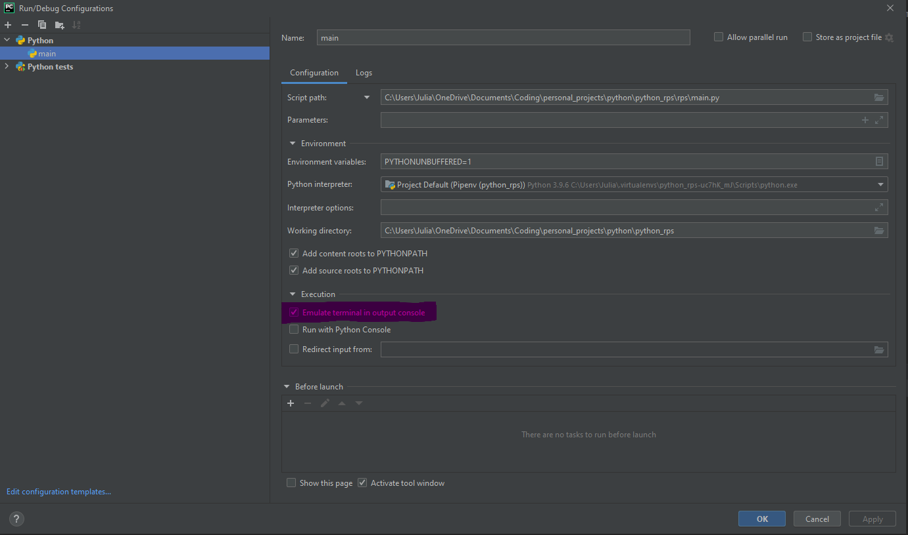

# Rock Paper Scissors
This is a Python 3 implementation of Rock Paper Scissors which is played in the terminal.

## Pre-Requisites
This app was built using [Pipenv](https://docs.pipenv.org/), so the only pre-requisite is that you have that installed!
Pipenv will create a virtual environment where it will install all the required packages (including the necessary version 
of Python) to run this app.

## Setup
1) Clone this project.
2) In your terminal, `cd` to the project root directory (`/python_rps`) and run `pipenv install`.
3) You can then run the app in the terminal, or an IDE of your choice that is compatible with python (e.g. PyCharm, 
   Spyder, IDLE, etc):
    ### Terminal
    * Run `<your python executable> .rps/main.py` from the project root directory in the terminal of your choice
        * e.g. `python.exe ./rps/main.py`
        * e.g. `python3 ./rps/main.py`
    ### IDE
    * Run the `main.py` file in your IDE of choice
        * For the game to run properly, please make sure you configure the project to **emulate terminal in output 
          console**. This is required to ensure that player move entry is hidden.
        * For example, in PyCharm, you would configure your run like this:
        

## How To Play
Once you have started up the game, a new game session will immediately launch. This game requires exactly 2 players and 
you will be asked to enter the player names first.

Once players have been set up, each player will need to select their move by entering a number in the terminal. Your
entry will not be displayed so that your opponent will not know what your move is (assuming they're not looking at the
keyboard)!

| Input | Move     |
|:-----:|:--------:|
|   1   | ROCK     |
|   2   | PAPER    |
|   3   | SCISSORS |

Player 1 goes first. Once both players have entered their moves, the game will automatically work out who the winner is.

At the end of each match, you will have 3 options available to you:

| Input | Option                |
|:-----:|:----------------------|
|   s   | View the scoreboard   |
|   p   | Play another match    |
|   q   | Quit the game         |

## FAQ
* Why is the output displaying weirdly in my Git Bash, with lots of random strings at the beginning?
  * You are likely using a Windows system and your Git Bash to use the MinTTY terminal, which is not ANSI compatible.
    To work around this, you can either:
      * Uninstall then reinstall Git Bash, ensuring you select **Use Windows default console window**
        when configuring the terminal emulator.
      * Run the app in an IDE such as PyCharm, making sure it is configured to emulate terminal in the output console 
        (see **Setup**)
      * Use another terminal which is ANSI compatible, such as `cmd` or `Powershell`.
      * Switch to use a Linux or MacOS (super simple, right?) 